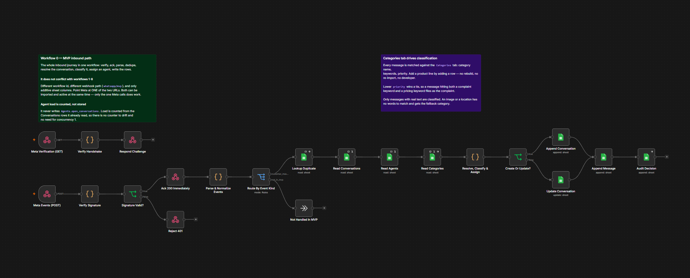

# WhatsApp Support Routing

Turns one WhatsApp business number into a shared inbox a whole team can work
from — in a Google Sheet, with no app to install and nothing new to learn.

---

## See it explained

**[A walkthrough of the whole system, in Arabic](https://mohammad-khalifah1.github.io/Whatsapp-automation-n8n/)**
— the message journey step by step, how a manager reads the sheet, the three
reply paths, the two ways to connect a number, the limits, and the real cost.
Written for someone who will use the system, not build it.

Source: [visualization/flow.html](visualization/flow.html).

> **One-time setting to publish it:** *Settings → Pages → Build and deployment →
> Source: Deploy from a branch → `main` / `/ (root)`*. The repository root
> carries an `index.html` that redirects to the page above.

---

## The problem this solves

A small business puts its WhatsApp number on a poster, and it works: customers
message. Then it stops working.

One phone holds every conversation, so only whoever is holding it can answer.
Nobody else knows who is still waiting. Two people answer the same customer, or
nobody does. When someone is off, their conversations are simply unreachable.
There is no record of who said what, no way to see how long people waited, and
no way to tell a busy week from a quiet one. The number becomes a liability
nobody wants to be responsible for.

Buying a helpdesk fixes that and introduces its own problems: a monthly fee per
seat, a new tool everyone has to be trained on, and your customer history living
somewhere you do not control.

## What this does instead

Every message that arrives is written to a **Google Sheet**, one row per
customer, and handed automatically to the team member with the fewest open
conversations — who then keeps that customer until the conversation is done.

Everyone on the team opens the same sheet. To answer someone, they type into a
cell. Within a minute the customer receives it on WhatsApp, exactly as if it had
been typed on the phone.

| What the team gets | How |
|---|---|
| A shared inbox | One Google Sheet. Everyone already knows how to use it. |
| Work split fairly, automatically | Each new customer goes to whoever has the fewest open conversations |
| Nobody dropped | A row shows every message still waiting for an answer — not just the last one |
| No two people answering the same customer | Each conversation has one owner, and it does not move |
| A reply without leaving the sheet | Type in `reply_text`; the customer gets it within a minute |
| An answer to "how are we doing?" | A dashboard of live figures: who is waiting, for how long, per agent |
| Nothing lost | Every message ever sent or received is kept. Archiving moves rows; it never deletes them |

## Who it is for

A business of **2 to 20 people** handling customer questions on WhatsApp:
a shop, a clinic, a workshop, a delivery service, an agency. Small enough that a
per-seat helpdesk is not worth it; big enough that one phone is no longer
enough.

It runs on a **$5–8/month server**, and WhatsApp charges nothing for replying to
customers who messaged you. There is no per-seat fee and no license to buy —
see [docs/CLIENT_ONBOARDING.md](docs/CLIENT_ONBOARDING.md) for the full costing,
checked against each vendor's own documentation.

## See the sheet

<!-- Paste a link to a DEMO COPY of the sheet here — one with invented rows.
     File > Make a copy of your working sheet, delete every data row, add a
     handful of fake conversations, then Share > Anyone with the link > Viewer. -->

**Demo sheet:** _(not published yet — see the warning below)_

> ⚠️ **Do not put the live sheet link here.** This repository is public, and the
> working sheet holds real customer phone numbers and the text of real
> conversations. Anyone who found this page would be able to read them.
>
> Share a **copy with invented rows** instead. It is also the better thing to
> show a prospective client: real customers' messages are not yours to display.

The layout it produces, including the Dashboard tab, is described in
[docs/GOOGLE_SHEETS_SCHEMA.md](docs/GOOGLE_SHEETS_SCHEMA.md). To build it in your
own spreadsheet, paste [sheets-templates/SetupSheet.gs](sheets-templates/SetupSheet.gs)
into *Extensions → Apps Script* and run `setupEverything`.

---

## What it is, technically

A WhatsApp customer-support routing and conversation-tracking system built on
the Meta WhatsApp Cloud API, n8n and Google Sheets. A customer messages your
business number; the system finds or creates their conversation, assigns an
agent, records every message, and keeps the sheet a manager actually reads up to
date.

Nothing is invented for the sake of it: the "database" is a spreadsheet because
a spreadsheet is the interface the business already has, and the honest limits
of that choice are written down in
[docs/ARCHITECTURE.md](docs/ARCHITECTURE.md) rather than glossed over.

---

## Features

| Area | What it does |
|---|---|
| **Inbound** | Every WhatsApp message becomes a row. Signature-verified over raw bytes, deduplicated on the message id, acknowledged in under 100 ms |
| **Two connectors** | Meta Cloud API, or [WAHA](docs/WAHA_CONNECTOR.md) to link a number by QR with nothing deleted. `WHATSAPP_CONNECTOR` picks one |
| **Routing** | Each new conversation goes to the agent with the fewest open ones and stays with them. Capacity and availability are respected |
| **Replying** | Type into the sheet, use the WhatsApp Business app, or call the API. All three are recorded |
| **Tracking** | Five conversation states, unread flag, first and last message timestamps, and a count of messages still unanswered |
| **Dashboard** | A live tab with six figures and four charts — volume over 14 days, status mix, load per agent, and what customers ask for |
| **History** | Every message is kept. Nightly archiving moves rows to an Archive tab; nothing is deleted |
| **Operations** | A dedicated error workflow, retries on transient Sheets failures, and monitoring that catches a workflow that stopped running |

## Limitations

Real constraints, not roadmap items.

| Limit | What it means |
|---|---|
| **No AI** | No auto-reply and no automatic classification anywhere. `product` and `quantity` are typed by a person |
| **WAHA is not sanctioned by Meta** | It automates WhatsApp Web, which the Terms of Service do not permit. Real, unpredictable ban risk with no reliable appeal — [the honest version](docs/WAHA_CONNECTOR.md) |
| **Sheet replies take up to a minute** | The reply workflow polls once per minute. The WhatsApp Business app is instant |
| **Google Sheets is not a database** | 60 writes per minute per user. Around 300 conversations a day it returns 429s — that is when to move to [Postgres](docs/GOOGLE_SHEETS_TO_POSTGRES.md) |
| **Assignment is not atomic** | Sheets has no compare-and-set, so two simultaneous conversations can reach the same agent. Workflow 3 serializes with `concurrency: 1` — [the analysis](docs/ASSIGNMENT_ALGORITHM.md) |
| **Replies from a personal account are invisible** | Meta only emits webhooks for the business number. [Coexistence](docs/COEXISTENCE.md) mirrors Business-app replies; a personal WhatsApp is not tracked |
| **Coexistence caps throughput at 20 messages/second** | Against 80 by default. Irrelevant below a few hundred conversations a day |
| **Meta's test mode allows 5 recipients** | Until business verification, which takes days to weeks |
| **Replying after 24 hours costs money** | Once the customer service window closes, only a paid template reopens it |
| **One server, no failover** | A single VPS runs everything. Not a basis for promising uptime to a client |
| **n8n's licence does not allow reselling** | Free for your own business; hosting clients' workflows needs an Enterprise licence at an unpublished price — [detail](docs/COSTS.md#is-n8n-really-free) |

---

## Status

**Live and verified end to end.** Every row below was executed against the
running deployment, not inspected in the code.

| Area | State |
|---|---|
| Docker + n8n environment | **Live** — n8n 2.38.5 on a VPS, behind nginx and Let's Encrypt |
| Core business logic | **192 unit tests passing** |
| Webhook receiver | **Verified live** — the handshake echoes the challenge; unsigned and wrongly-signed POSTs are refused |
| Inbound message to a sheet row | **Verified live** |
| Automatic assignment | **Verified live** — the eligible agent with the fewest open conversations |
| Agent stickiness | **Verified live** — the agent who owns a conversation keeps it |
| Agent capacity limits | **Verified live** — at capacity, a conversation waits rather than being forced on someone |
| Idempotency on redelivery | **Verified live** — no duplicate conversation or message row |
| Reply from the sheet | **Verified live** — including a real message to a real number |
| Messaging a new number by hand | **Verified live** |
| Archiving | **Verified live, 17 checks** — both the `ARCHIVED` status and the sweep of long-closed conversations, including a two-row batch that leaves the third row untouched |
| Newest-first ordering | **Verified live** — both Conversations and Messages |
| Dashboard | **Live formulas** over Conversations, Messages, Archive and Agents |
| Coexistence (WhatsApp Business App echoes) | **Built and unit-tested**; needs Coexistence enabled on the number |

Reproduce all of it:

```
node scripts/testing/verify-live.js
node scripts/testing/verify-live.js --real-send=9627XXXXXXXX   # sends for real
node scripts/testing/verify-archive.js                         # 17 archive checks
```

See [docs/TESTING.md](docs/TESTING.md) for what each check proves, and
[CHANGELOG.md](CHANGELOG.md) for what was built when.

---

## Quick start

```bash
# 1. Configure
cp .env.example .env
#    Then fill in .env — see docs/ENVIRONMENT.md for every variable.
#    At minimum you need N8N_ENCRYPTION_KEY and WEBHOOK_VERIFY_TOKEN.

# 2. Start n8n
docker compose up -d

# 3. Verify it is healthy
curl http://localhost:5678/healthz        # -> {"status":"ok"}

# 4. Build and import the workflows
node scripts/setup/build-workflows.js
node scripts/setup/import-workflows.js

# 5. Run the tests
node tests/run-tests.js                   # 192 unit tests, no credentials needed
node scripts/validation/validate-workflows.js
```

Then open <http://localhost:5678>, create the two credentials, and publish the
workflows — full walkthrough in **[docs/SETUP.md](docs/SETUP.md)**.

---

## How it works

```
WhatsApp customer
      |
      v
Meta WhatsApp Cloud API
      |
      |  POST (HMAC-signed)
      v
[1] Webhook Receiver ───── verifies signature, acks 200 in <100ms
      |
      v
[2] Message Processor ──── parses, deduplicates, routes by event kind
      |
      v
[3] Conversation & Assignment ── finds/creates conversation,
      |                          picks least-loaded agent
      v
Google Sheets  (Agents · Conversations · Messages · Events)
      ^
      |
[4] Outgoing Agent Message ── the ONLY supported reply path
[5] Unassigned Queue Retry ── re-tries conversations nobody could take
[6] Error Handler ─────────── records failures, redacts secrets
[7] Reply From Sheet ──────── type in a cell, customer gets a WhatsApp message
[8] Archive Conversations ─── nightly, keeps the working sheet small
```

<p align="center">
  
</p>
<p align="center">
  <sub>
    The inbound path on the n8n canvas — verify, acknowledge, parse, deduplicate,
    resolve the conversation, assign an agent, write the rows.<br>
    Captured from the single-workflow variant that <a href="CHANGELOG.md">0.4.0</a>
    removed, so the <code>Categories</code> node and the <code>whatsapp/mvp</code>
    path in it no longer exist. The shape of the journey is the same; the shipped
    version splits it across workflows 1-3 and is drawn below.
  </sub>
</p>

### What workflow 3 actually does

This is the path a customer's message takes, node by node. It is the workflow
worth understanding — the other seven are short.

```
 Called by workflow 2
          │
          ▼
 Find Existing Conversation ──── read Conversations, filtered to this number
          │
          ▼
 Decide Create Or Update ─────── same customer, same business number?
          │                      → update it.  otherwise → create it.
          ▼
 Needs Assignment? ───────────── does it already have an owner?
     │           │
   false        true
     │           │
     │           ▼
     │   Read All Conversations ─ count each agent's REAL open load
     │           │                (the stored counter only ever grows)
     │           ▼
     │      Read Agents ───────── active, available, under capacity
     │           │
     │           ▼
     │      Select Agent ──────── fewest open conversations wins;
     │           │                ties go to whoever waited longest
     │           ├──────────────► Increment Agent Load
     │           │
     ▼           ▼
 Build Conversation Row ──────── one object, write_row, holding exactly
          │                      what should end up in the sheet
          ▼
 Create Or Update Row? ───┬───► Append Conversation   (new customer)
                          └───► Update Conversation   (existing row)
                                        │
                                        ▼
                                 Append Message ────── the message itself,
                                        │              never overwritten
                                        ▼
                                 Audit Assignment ──── who got it and why
                                        │
                                        ▼
                        Sign → Get Token → Sort Newest First
                                 keeps the newest at the top of both tabs
```

Full detail: **[docs/ARCHITECTURE.md](docs/ARCHITECTURE.md)**.

---

## Running costs

| | 30 conv/day | 100 conv/day | 300 conv/day |
|---|---|---|---|
| **You pay, per month** | **$10.32** | **$10.32** | **$14.84** |

A VPS and a domain, plus Jordanian tax. That is the whole bill.

Everything else is genuinely free and stays free: **Meta charges nothing** for
receiving webhooks, nothing for inbound customer messages, and nothing today for
replies sent inside the 24-hour window. n8n Community, the Google Sheets API,
Let's Encrypt, Caddy, Telegram notifications, uptime monitoring and off-site
backups are all $0.

Ten times the traffic costs 44% more, because the only thing that changes is
needing a slightly larger box.

**Two things worth knowing before October:**

Meta has confirmed, verbatim, that *"Effective October 1, 2026, Meta will charge
on a per-message basis for service messages"* — the replies this system sends.
**The rate is still not published**; Meta's own page said it would be announced
"no later than September 1, 2026" and that date has passed with no rate card. If
it lands at the current utility rate of $0.0091, the bill becomes roughly
$31 / $106 / $324 a month.

Whether that happens at all depends on one unanswered question: agents here
reply from the **WhatsApp Business app** via Coexistence, and no Meta page says
whether those replies are billed. If they are not, Meta stays at $0.

Full breakdown, what could not be verified, and alternatives for every layer:
**[docs/COSTS.md](docs/COSTS.md)** and
**[docs/ALTERNATIVES.md](docs/ALTERNATIVES.md)**.

> **This README used to say $22 to $161, and COSTS.md said $122 to $443.** Both
> were wrong the same way: they priced an AI auto-reply feature **this system
> does not have**, and folded the owner's own maintenance hours into the invoice
> as if they were a bill. Maintenance is real — about 1–2 hours a month — but it
> is time, not cash, and it is now kept in its own section.

---

## Repository layout

```
├── docker-compose.yml          n8n stack (pinned to 2.38.5)
├── .env.example                every variable, documented, no real values
├── CHANGELOG.md                what was actually built and verified
│
├── docs/                       see the index below
│
├── n8n/
│   ├── workflows/              GENERATED — do not hand-edit
│   │   01-08…                  the eight workflows, in order
│   └── fixtures/               10 real-shape Meta webhook payloads
│
├── scripts/
│   ├── lib/                    canonical business logic (unit-tested)
│   ├── setup/                  build workflows, apply the sheet layout,
│   │                           build the dashboard, import + publish
│   ├── validation/             workflow, config and schema validators
│   └── testing/                fixture sender, live end-to-end verification
│
├── sheets-templates/           CSV headers + an optional in-sheet menu
└── tests/                      192 tests, zero npm dependencies
```

**`scripts/lib/` is the single source of truth for business logic.** n8n Code
nodes cannot import host files, so `scripts/setup/build-workflows.js` inlines
these exact files into the workflow JSON. Never edit logic inside n8n — edit
`scripts/lib/`, re-run the build, and re-import. This is what keeps the tested
code and the running code identical.

---

## Documentation

| Document | What it covers |
|---|---|
| [COSTS.md](docs/COSTS.md) | **Every running cost, verified against vendor pages** — plus alternatives per layer, and the 1 Oct 2026 change that ends free service messages |
| [ALTERNATIVES.md](docs/ALTERNATIVES.md) | **A cheaper or freer replacement for every layer** — with licences, real free-tier limits, and what to do if you resell this |
| [CLIENT_ONBOARDING.md](docs/CLIENT_ONBOARDING.md) | **Deploying this for a client** — what to ask them for, what it costs, whether it has to be a VPS |
| [OPERATING_GUIDE.md](docs/OPERATING_GUIDE.md) | **Start here for daily use** — the three reply paths, filtering, speed, archiving |
| [COEXISTENCE.md](docs/COEXISTENCE.md) | Making WhatsApp Business App replies visible to the system |
| [ARCHITECTURE.md](docs/ARCHITECTURE.md) | Components, data flow, state machine, phone normalization |
| [SETUP.md](docs/SETUP.md) | Step-by-step local setup, credentials, tunnels |
| [ENVIRONMENT.md](docs/ENVIRONMENT.md) | Every environment variable and where it is read |
| [META_WHATSAPP_SETUP.md](docs/META_WHATSAPP_SETUP.md) | Meta app, WABA, phone number, tokens, webhook config |
| [WAHA_CONNECTOR.md](docs/WAHA_CONNECTOR.md) | Alternative: QR-linked number, no deletion, no Meta approval — and the real ban risk that comes with it |
| [N8N_WORKFLOWS.md](docs/N8N_WORKFLOWS.md) | Each workflow: inputs, outputs, errors, idempotency |
| [GOOGLE_SHEETS_SCHEMA.md](docs/GOOGLE_SHEETS_SCHEMA.md) | All six tabs, every column, and how to reply and archive from the sheet |
| [ASSIGNMENT_ALGORITHM.md](docs/ASSIGNMENT_ALGORITHM.md) | Selection rules, tie-breaking, and the concurrency limits |
| [SECURITY.md](docs/SECURITY.md) | Secret handling, signature verification, least privilege |
| [ERROR_HANDLING.md](docs/ERROR_HANDLING.md) | Every failure mode and what the system does about it |
| [TESTING.md](docs/TESTING.md) | The three test levels and the 25 required scenarios |
| [TROUBLESHOOTING.md](docs/TROUBLESHOOTING.md) | Symptoms, causes, fixes |
| [GOOGLE_SHEETS_TO_POSTGRES.md](docs/GOOGLE_SHEETS_TO_POSTGRES.md) | Exactly what changes when moving to Postgres |
| [FUTURE_AGENT_INBOX.md](docs/FUTURE_AGENT_INBOX.md) | The web inbox this is designed to grow into |
| [FUTURE_AI.md](docs/FUTURE_AI.md) | Where an AI layer plugs in, and where it must not |
| [FUTURE_TASKS_EMPLOYEES_AND_AI_AGENTS.md](docs/FUTURE_TASKS_EMPLOYEES_AND_AI_AGENTS.md) | Task-board framing, employee management, anti-bot-detection, and grounding AI answers in this business only |
| [DEPLOYMENT_HOSTINGER.md](docs/DEPLOYMENT_HOSTINGER.md) | VPS deployment, TLS, firewall, backups, costs |
| [KUBERNETES_MIGRATION.md](docs/KUBERNETES_MIGRATION.md) | If and when Compose stops being enough |
| [DECISIONS.md](docs/DECISIONS.md) | Why each significant choice was made |

---

## Security

`.env` is git-ignored and contains every secret. `.env.example` contains only
placeholders. Workflow JSON is scanned for hard-coded credentials by
`scripts/validation/validate-workflows.js`, and all log output passes through a
redactor that masks tokens, keys, and signatures.

Never commit `.env`. Full policy: [docs/SECURITY.md](docs/SECURITY.md).
